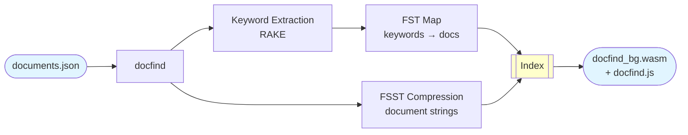

# docfind

A high-performance document search engine built in Rust with WebAssembly support. Combines full-text search using FST (Finite State Transducers) with FSST compression for efficient storage and fast fuzzy matching capabilities.

## Live Demo

Check out the [interactive demo](https://microsoft.github.io/docfind/). The demo showcases docfind searching through 50,000 news articles from the AG News dataset, running entirely in your browser with WebAssembly.

**Demo Performance Metrics:**
- **Dataset**: 50,000 news articles (AG News Classification Dataset)
- **Dataset Size**: 17.14 MB ([uncompressed JSON](https://github.com/microsoft/docfind/raw/refs/heads/main/static/documents.json))
- **Index Size**: 11.48 MB ([WASM file](https://github.com/microsoft/docfind/raw/refs/heads/main/static/docfind_bg.wasm))
- **Compressed Size**: 5.20 MB ([compressed with Brotli](https://github.com/microsoft/docfind/raw/refs/heads/main/static/docfind_bg.wasm.br))
- **Index Build Time**: ~1.1 seconds
- **Load Time**: ~100ms (depending on network and browser)
- **Search Speed**: ~1-3ms per query

## Features

- **Fast Fuzzy Search**: Uses FST for efficient keyword matching with Levenshtein distance support
- **Compact Storage**: FSST compression reduces index size while maintaining fast decompression
- **RAKE Keyword Extraction**: Automatic keyword extraction from document content using the RAKE algorithm
- **WebAssembly Ready**: Compile to WASM for browser-based search with no server required
- **Standalone CLI Tool**: Self-contained CLI tool to build a .wasm file out of a collection of documents, no Rust tooling required

## Installation

### Quick Install

**macOS/Linux:**
```bash
curl -fsSL https://microsoft.github.io/docfind/install.sh | sh
```

**Windows (PowerShell):**
```powershell
irm https://microsoft.github.io/docfind/install.ps1 | iex
```

The installer will:
- Download the latest release binary for your platform
- Install it to `~/.local/bin` (Unix) or `~\.docfind\bin` (Windows)
- Provide instructions for adding it to your PATH if needed

### Manual Installation

Download the binary for your platform from the [latest release](https://github.com/microsoft/docfind/releases/latest):

- **macOS (Intel)**: `docfind-x86_64-apple-darwin`
- **macOS (Apple Silicon)**: `docfind-aarch64-apple-darwin`
- **Linux (x64)**: `docfind-x86_64-unknown-linux-musl`
- **Linux (ARM64)**: `docfind-aarch64-unknown-linux-musl`
- **Windows (x64)**: `docfind-x86_64-pc-windows-msvc.exe`
- **Windows (ARM64)**: `docfind-aarch64-pc-windows-msvc.exe`

Rename it to `docfind` (or `docfind.exe` on Windows), make it executable, and place it in your PATH.

### Building from Source

#### Prerequisites

Before building from source, ensure you have the following installed:

1. **Rust** - [rustup.rs](https://rustup.rs/)
2. **wasm-pack** - [drager.github.io/wasm-pack](https://drager.github.io/wasm-pack/)
3. **Node.js** - [nodejs.org](https://nodejs.org/) (required for esbuild)

#### Build

```bash
./scripts/build.sh
```

The compiled binary will be available at `./target/release/docfind`.

## Usage

### Creating a Search Index

Prepare a JSON file with your documents:

```json
[
  {
    "title": "Getting Started",
    "category": "docs",
    "href": "/docs/getting-started",
    "body": "This guide will help you get started."
    },
    {
    "title": "API Reference",
    "category": "reference",
    "href": "/docs/api",
    "body": "Complete API documentation for all search functions and configuration options."
    }
]
```

Build the index and generate a WASM module:

```bash
docfind documents.json output
```

This creates:
- `output/docfind.js` - JavaScript bindings
- `output/docfind_bg.wasm` - WebAssembly module with embedded index

### Using in the Browser

```html
<script type="module">
  import search from 'docfind.js';
  
  const documents = await search('needle');
  console.log(documents);
</script>
```

## How It Works



1. **Indexing Phase** (CLI):
   - Extracts keywords from document titles, categories, and bodies
   - Uses RAKE algorithm to identify important multi-word phrases
   - Assigns relevance scores based on keyword source (metadata > title > body)
   - Builds an FST mapping keywords to document indices
   - Compresses all document strings using FSST
   - Serializes the index using Postcard (binary format)

2. **Embedding Phase** (CLI):
   - Parses the pre-compiled WASM module
   - Expands WASM memory to accommodate the index
   - Patches global variables (`INDEX_BASE`, `INDEX_LEN`) with actual values
   - Adds the index as a new data segment in the WASM binary

3. **Search Phase** (WASM):
   - Deserializes the embedded index on first use
   - Performs fuzzy matching using Levenshtein automaton
   - Combines results from multiple keywords with score accumulation
   - Decompresses matching document strings on demand
   - Returns ranked results as JavaScript objects

## Dependencies

- **fst**: Fast finite state transducer library with Levenshtein support
- **fsst-rs**: Fast string compression for text data
- **rake**: Rapid Automatic Keyword Extraction algorithm
- **serde/postcard**: Efficient serialization
- **wasm-bindgen**: WebAssembly bindings for Rust
- **wasm-encoder/wasmparser**: WASM manipulation tools

## Performance

The combination of FST and FSST provides:
- Sub-millisecond search times for typical queries
- 60-80% compression ratio for document storage
- Instant startup with lazy index loading
- Zero network requests after initial load

## References

### Prior Art

This project builds on the rich ecosystem of search technologies:

- **[Algolia](https://www.algolia.com/)** - Server-side search-as-a-service platform
- **[TypeSense](https://typesense.org/)** - Open-source server-side search engine
- **[Lunr.js](https://lunrjs.com/)** - Client-side full-text search library for JavaScript
- **[Stork Search](https://stork-search.net/)** - WebAssembly-powered search for static sites
- **[Tinysearch](https://endler.dev/2019/tinysearch/)** - Minimalist WASM-based search engine

### Technical Foundations

Key technologies and concepts that inspired and power docfind:

- **[Finite State Transducers](https://burntsushi.net/transducers/)** - Andrew Gallant's comprehensive article on FSTs, the core data structure for efficient search
- **[RAKE Algorithm](https://docs.rs/rake/latest/rake/)** - Rapid Automatic Keyword Extraction for identifying important phrases
- **[FSST Compression](https://docs.rs/fsst-rs/latest/fsst/index.html)** - Fast Static Symbol Table compression for efficient text storage
